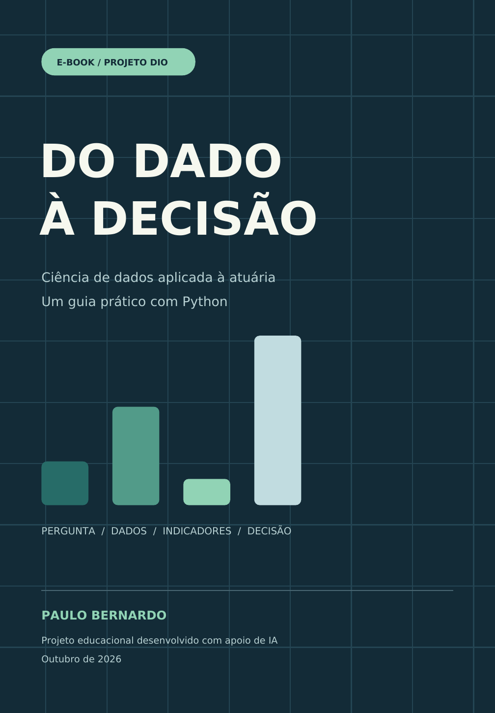

# Do dado à decisão

**Ciência de dados aplicada à atuária: um guia prático com Python.**



Projeto educacional desenvolvido com apoio de inteligência artificial para
o desafio de criação de e-books da DIO. O material apresenta uma análise
descritiva de uma carteira fictícia de seguros, com exemplos resolvidos,
código reproduzível e documentação dos prompts.

**Autoria do projeto:** Paulo Bernardo.

## E-book e artigo

- [Leia o e-book completo em PDF](output/Do_Dado_a_Decisao.pdf).
- [Leia o artigo: Como criei um e-book de dados e atuária com apoio de IA](https://github.com/psbjzx/ebook-do-dado-a-decisao)
- [Consulte o conteúdo editável em Markdown](conteudo/ebook.md).

O link do artigo acima abre o texto incluído neste repositório. Após
publicá-lo na comunidade DIO, substitua o destino desse link pela URL
pública do artigo. O [guia de entrega](GUIA_ENTREGA.md) explica esse passo.

## O que o leitor aprende

- Definir uma pergunta de análise e reconhecer a unidade de exposição.
- Calcular frequência, severidade e custo por exposição.
- Distinguir uma taxa de ocorrências de uma probabilidade.
- Agregar indicadores com pesos adequados.
- Validar uma base pequena e reproduzir os cálculos em Python.
- Comunicar resultados e limitações de uma análise descritiva.

## Caso numérico

Os dados são inteiramente sintéticos e representam o mesmo período.

| Segmento | Exposição em contratos-ano | Sinistros | Custo total (R$) | Custo por exposição (R$) |
| --- | ---: | ---: | ---: | ---: |
| A | 1.000 | 20 | 100.000,00 | 100,00 |
| B | 800 | 24 | 180.000,00 | 225,00 |
| C | 1.200 | 12 | 72.000,00 | 60,00 |
| D | 400 | 16 | 160.000,00 | 400,00 |
| **Carteira** | **3.400** | **72** | **512.000,00** | **150,59** |

O custo por exposição da carteira usa o custo total dividido pela exposição
total. A média simples dos quatro segmentos é R$ 196,25 e responde a uma
pergunta diferente. Os valores são históricos e ilustrativos.

## Prompts documentados

| Etapa | Arquivo |
| --- | --- |
| Título e estrutura | [01_titulo_e_estrutura.md](prompts/01_titulo_e_estrutura.md) |
| Conteúdo | [02_conteudo.md](prompts/02_conteudo.md) |
| Revisão | [03_revisao.md](prompts/03_revisao.md) |
| Diagramação | [04_diagramacao.md](prompts/04_diagramacao.md) |
| Artigo e README | [05_artigo_e_readme.md](prompts/05_artigo_e_readme.md) |

Os arquivos registram as instruções aplicadas ao projeto. A diagramação e
os elementos visuais foram produzidos por código conforme o briefing.

## Ferramentas efetivamente utilizadas

| Ferramenta | Uso |
| --- | --- |
| ChatGPT / Codex | Apoio ao conceito, conteúdo, código, revisão e documentação. |
| Python | Validação da base e cálculo dos indicadores. |
| ReportLab | Diagramação do e-book em PDF. |
| Matplotlib | Gráfico calculado com os dados sintéticos. |
| Poppler | Renderização das páginas para revisão visual. |
| DejaVu Sans | Fontes incorporadas ao PDF, com licença incluída. |

## Arquivos do projeto

| Pasta ou arquivo | Conteúdo |
| --- | --- |
| [output/](output/) | E-book em PDF e resultados da análise. |
| [prompts/](prompts/) | Prompts e briefings utilizados. |
| [artigo/](artigo/) | Texto do artigo para revisão e publicação. |
| [conteudo/](conteudo/) | Texto editável em Markdown e conteúdo estruturado em JSON. |
| [dados/](dados/) | Carteira sintética utilizada nos exemplos. |
| [assets/](assets/) | Capa, gráfico e fontes com licença. |
| [scripts/](scripts/) | Análise da carteira e geração do e-book. |
| [docs/referencias.md](docs/referencias.md) | Fontes e créditos. |
| [docs/validacao.md](docs/validacao.md) | Conferência técnica e visual da entrega. |
| [GUIA_ENTREGA.md](GUIA_ENTREGA.md) | Publicação e envio do desafio à DIO. |

## Reproduza a análise

Requer Python 3.10 ou superior. Na pasta do projeto:

```bash
python scripts/analisar_carteira.py
```

A análise usa apenas a biblioteca padrão e grava os indicadores em
`output/analise_resultados.json`.

## Gere novamente o e-book - opcional

O PDF final já está incluído. Para produzir uma nova edição:

```bash
python -m pip install -r requirements.txt
python scripts/gerar_ebook.py
```

O script lê `conteudo/ebook.json`, recalcula a análise e gera o PDF,
o gráfico e o conteúdo em Markdown. Se alterar os dados, revise também
os exemplos escritos, os exercícios, o artigo e este README para manter
todo o material consistente.

## Referência e créditos

Projeto inspirado no
[repositório de Felipe Aguiar](https://github.com/felipeAguiarCode/prompts-recipe-to-create-a-ebook),
fornecido no desafio da DIO. Os textos, os dados sintéticos e o código
foram preparados para esta entrega. As fontes conceituais e a licença
das fontes tipográficas estão documentadas em [referencias.md](docs/referencias.md).

**Tags sugeridas:** `ebook`, `dio`, `inteligencia-artificial`, `prompts`,
`python`, `atuaria`, `ciencia-de-dados`.
