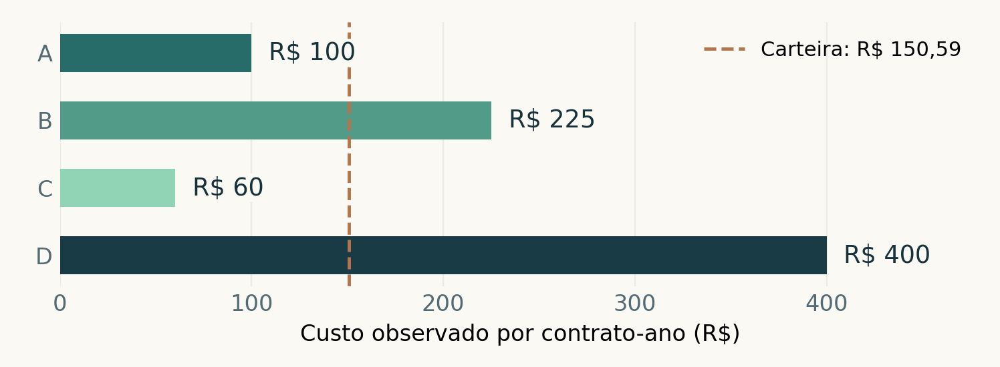

# Do dado à decisão

**Ciência de dados aplicada à atuária: um guia prático com Python**

Autoria: Paulo Bernardo. Outubro de 2026. Projeto educacional com apoio de IA.

## Um guia para começar

Este guia mostra como transformar uma pergunta de negócio em uma análise descritiva de risco. Com uma carteira fictícia, você vai calcular indicadores, comparar grupos e explicar os resultados.

Para estudantes e profissionais iniciantes. Os exemplos usam operações básicas e incluem código Python reproduzível. Leia a sequência completa ou consulte os capítulos pelo sumário.

| Página | Conteúdo |
| --- | --- |
| 3 | Escreva uma pergunta útil |
| 4 | Três indicadores, três unidades |
| 5 | Conheça a carteira fictícia |
| 6 | Valide antes de calcular |
| 7 | Calcule o segmento A |
| 8 | Compare grupos com cuidado |
| 9 | A carteira pede ponderação |
| 10 | Reproduza em Python |
| 11 | Explique o resultado e o limite |
| 12 | Separe descrição de previsão |
| 13 | Use IA com uma tarefa clara |
| 14 | Pratique e confira |
| 15 | Fontes e termos essenciais |

**O que você vai produzir:** Uma análise de frequência, severidade e custo por exposição, com código e interpretação.

## Escreva uma pergunta útil

Antes de abrir uma base, defina a decisão que a análise pretende apoiar. Uma pergunta ampla, como “qual grupo tem mais risco?”, mistura fenômenos diferentes. Quantidade de ocorrências, custo médio e volume de exposição precisam ser considerados separadamente.

### A pergunta deste projeto

**Pergunta central:** Como o custo observado por contrato-ano varia entre quatro segmentos de uma carteira fictícia, durante o mesmo período?

Essa pergunta define a unidade de comparação, o período e o indicador. Primeiro descrevemos o histórico. Uma previsão exigiria hipóteses e uma avaliação adicional.

- Qual é o período observado?
- Os grupos têm a mesma definição de sinistro e de custo?
- A exposição está medida de forma comparável?
- Que informação falta para explicar as diferenças?

### Transforme a pergunta em uma entrega

Uma entrega pequena pode conter uma tabela, um gráfico e três frases: o principal resultado, a hipótese que sustenta a comparação e a limitação que o leitor precisa conhecer. Esse formato facilita a conversa entre quem analisa e quem decide.

## Três indicadores, três unidades

Use E para exposição, N para quantidade de sinistros e C para o custo total associado a esses sinistros. No caso do guia, exposição é o tempo de cobertura somado, em contratos-ano. Dois contratos ativos por meio ano equivalem a um contrato-ano.

**Frequência = N / E**

Sinistros por contrato-ano.

**Severidade = C / N**

Reais por sinistro, quando N > 0.

**Custo por exposição = C / E**

Reais por contrato-ano.

Quando N > 0, multiplicar frequência por severidade também resulta em C / E. Essa é uma identidade entre os indicadores observados. As definições são compatíveis com o exemplo de seguros da referência [1].

**Frequência não é automaticamente probabilidade:** Uma pessoa ou contrato pode registrar mais de um sinistro. A razão N / E é uma taxa de ocorrências por exposição, não uma porcentagem de pessoas afetadas.

Se não há sinistros, a severidade observada fica indefinida. Com N = 0 e C = 0, o custo por exposição é zero, mas isso não demonstra ausência de risco futuro.

## Conheça a carteira fictícia

Os quatro registros abaixo foram criados para este projeto. Todos representam um período comum. O custo de cada segmento está inteiramente apurado e corresponde aos sinistros contabilizados na mesma linha.

| Grupo | Exposição | Sinistros | Custo (R$) |
| --- | --- | --- | --- |
| A | 1.000 | 20 | 100.000,00 |
| B | 800 | 24 | 180.000,00 |
| C | 1.200 | 12 | 72.000,00 |
| D | 400 | 16 | 160.000,00 |

### Dicionário dos campos

- segmento: identificação fictícia do grupo, de A a D.
- exposicao_contratos_ano: soma do tempo coberto, em contratos-ano.
- sinistros: quantidade de ocorrências contabilizadas.
- custo_total: custo associado às ocorrências, em reais.

No arquivo JSON, os valores monetários são textos com ponto decimal, como “100000.00”. O script usa Decimal para realizar as operações sem passar pelo tipo float. Os números da edição em português usam vírgula decimal e ponto para separar milhares.

**Escopo do exemplo:** A base está agregada por segmento. Ela permite cálculos descritivos; não contém o histórico individual necessário para estudar diferenças entre contratos.

## Valide antes de calcular

Um indicador pode estar aritmeticamente correto e ainda responder à pergunta errada. Antes do cálculo, confira a estrutura da base e o significado de cada variável. A validação técnica complementa a revisão das regras do negócio.

### O que o script verifica

- Todos os registros têm os quatro campos obrigatórios.
- Os rótulos dos segmentos são textos não vazios e únicos após padronização.
- A exposição é positiva e os valores numéricos são finitos.
- O número de sinistros é um inteiro não negativo.
- O custo é não negativo. Neste caso, custo positivo requer sinistros contabilizados.

### O que ainda depende de revisão

O arquivo não prova que os períodos, as coberturas ou os critérios de apuração são comparáveis. Essa informação precisa acompanhar a coleta e a documentação. Também é preciso distinguir um registro duplicado de dois registros legítimos de períodos diferentes.

**Uma regra útil:** Não substitua automaticamente um valor ausente por zero. Ausência de informação e ausência de ocorrência têm significados diferentes.

Neste projeto, uma inconsistência interrompe a análise com uma mensagem. Isso torna a correção explícita e evita que um dado inválido desapareça silenciosamente.

## Calcule o segmento A

O segmento A tem 1.000 contratos-ano, 20 sinistros e custo total de R$ 100.000. Vamos usar a mesma linha para calcular os três indicadores.

**20 / 1.000 = 0,02**

Frequência: 0,02 sinistro por contrato-ano.

Outra forma de apresentar o resultado é dizer que foram observados dois sinistros a cada cem contratos-ano.

**100.000 / 20 = 5.000**

Severidade: R$ 5.000 por sinistro.

Esse valor resume o custo médio das ocorrências. Não informa o custo de cada sinistro individual, que poderia variar bastante.

**100.000 / 1.000 = 100**

Custo por exposição: R$ 100 por contrato-ano.

A conferência pela identidade dá o mesmo resultado: 0,02 × R$ 5.000 = R$ 100 por contrato-ano.

**Como interpretar:** No período e nas condições do exemplo, o grupo A apresentou esse custo médio por exposição. O cálculo é histórico e não constitui o preço comercial de um seguro.

## Compare grupos com cuidado

Compare os quatro grupos com as mesmas unidades. “Sin./100” indica sinistros a cada cem contratos-ano.

| Grupo | Sin./100 | Severidade (R$) | Custo/exp. (R$) |
| --- | --- | --- | --- |
| A | 2,00 | 5.000,00 | 100,00 |
| B | 3,00 | 7.500,00 | 225,00 |
| C | 1,00 | 6.000,00 | 60,00 |
| D | 4,00 | 10.000,00 | 400,00 |



Neste caso, D tem o maior custo por exposição. A linha tracejada indica o valor ponderado da carteira, explicado na próxima página.

**Uma diferença pede investigação:** Observe também a quantidade de sinistros, o volume de exposição e a composição do grupo. O gráfico descreve os registros; não identifica sozinho a causa da diferença.

## A carteira pede ponderação

Os segmentos têm tamanhos diferentes. Para calcular o indicador da carteira, some primeiro os custos e as exposições. Assim, cada contrato-ano tem o mesmo peso no resultado final.

| Exposição total | Sinistros | Custo total (R$) |
| --- | --- | --- |
| 3.400 | 72 | 512.000,00 |

**512.000 / 3.400 = 150,588235...**

Custo por exposição da carteira: R$ 150,59.

A média simples dos quatro indicadores seria (100 + 225 + 60 + 400) / 4 = R$ 196,25. Nesse cálculo, cada segmento recebe o mesmo peso, embora represente uma parcela diferente da exposição.

A média ponderada equivale a (1.000 × 100 + 800 × 225 + 1.200 × 60 + 400 × 400) / 3.400. Ela reproduz a razão entre o custo total e a exposição total.

### Confira também os outros totais

Frequência: 72 / 3.400 = aproximadamente 0,021176 sinistro por contrato-ano. Severidade: R$ 512.000 / 72 = aproximadamente R$ 7.111,11 por sinistro.

**Escolha o peso pela pergunta:** O custo por exposição usa exposição como peso. A severidade total usa a quantidade de sinistros. Uma média de médias só é apropriada quando seus pesos fazem sentido para a medida desejada.

## Reproduza em Python

Depois de extrair o pacote, abra um terminal na pasta do projeto. O script completo executa as validações da página 6 e grava os resultados em output/analise_resultados.json.

```bash
python scripts/analisar_carteira.py
```

O trecho abaixo mostra o cálculo da carteira e pressupõe a base já validada. Ele usa somente módulos da biblioteca padrão do Python [3, 4].

```python
import json
from decimal import Decimal as D
from pathlib import Path

base = Path("dados/carteira_sintetica.json")
linhas = json.loads(base.read_text(encoding="utf-8"))

e = sum(D(str(r["exposicao_contratos_ano"]))
        for r in linhas)
n = sum(r["sinistros"] for r in linhas)
c = sum(D(r["custo_total"]) for r in linhas)

frequencia = D(n) / e
severidade = c / D(n)
custo_por_exposicao = c / e

print(f"Frequência: {frequencia:.6f}")
print(f"Severidade: R$ {severidade:.2f}")
print(f"Custo/exposição: R$ {custo_por_exposicao:.2f}")
```

**Saída esperada:** Frequência: 0.021176; severidade: R$ 7111.11; custo/exposição: R$ 150.59. O terminal usa ponto decimal; o livro apresenta os mesmos valores com formatação brasileira.

## Explique o resultado e o limite

Uma boa síntese começa pelo que foi observado e indica o que ainda precisa ser investigado. No exemplo, a carteira apresentou R$ 150,59 por contrato-ano, e o segmento D teve o maior valor entre os quatro grupos.

### Um exemplo de comunicação

**Síntese para apresentação:** “Na carteira fictícia, o custo observado foi de R$ 150,59 por contrato-ano. O segmento D ficou acima do total. Para explicar a diferença, seria necessário revisar a composição dos grupos, a quantidade de sinistros e os critérios de apuração.”

### Perguntas para aprofundar

- Os contratos têm coberturas e limites semelhantes?
- Há poucos sinistros de alto custo concentrados em um grupo?
- O período é representativo ou houve uma ocorrência excepcional?
- Os custos estão suficientemente apurados para a comparação?

Os quatro totais agregados não permitem medir a variabilidade entre sinistros individuais, separar fatores explicativos ou comprovar uma relação causal. Registrar essa limitação ajuda o leitor a usar o resultado na medida certa.

Para avançar, seria necessário obter dados mais detalhados e comparáveis, mantendo a documentação das definições e da origem de cada campo.

## Separe descrição de previsão

Descrever o histórico e prever o futuro são tarefas diferentes. No primeiro caso, calculamos razões entre valores observados. No segundo, buscamos estimar um resultado ainda não conhecido e precisamos avaliar o erro dessa estimativa.

### Um processo mínimo de avaliação

- Defina o alvo e as informações disponíveis na data da previsão.
- Separe dados de desenvolvimento e avaliação antes de aprender transformações.
- Escolha uma forma de divisão compatível com o período e com registros repetidos.
- Compare o modelo a uma referência simples e examine seus erros.

Vazamento de dados ocorre quando a construção do modelo utiliza informação que não estaria disponível na previsão. Isso pode produzir uma avaliação otimista [2].

**Neste projeto:** Não ajustamos um modelo preditivo: há apenas quatro linhas agregadas. O objetivo é aprender indicadores, ponderação e reprodução de uma análise descritiva.

Uma projeção simples pode usar uma frequência histórica como hipótese. Se as condições mudarem, essa hipótese precisa ser revista. Mesmo quando a estimativa parece razoável, o resultado realizado continuará sujeito à incerteza.

## Use IA com uma tarefa clara

A IA pode ajudar a organizar explicações, propor uma estrutura e escrever uma primeira versão de código. Para obter uma resposta útil, descreva a tarefa, os dados, as restrições e o formato esperado. Depois confira o resultado com os valores do caso.

### Um prompt para revisar a análise

**Exemplo aplicado:** “Revise os indicadores de uma carteira fictícia com quatro segmentos. Confira se o total usa somas de custos e exposição. Explique a diferença entre frequência e probabilidade. Não apresente o custo histórico como preço comercial. Liste os pontos a corrigir.”

### Como os prompts foram organizados

- 01: título, público e estrutura do e-book.
- 02: conteúdo e caso numérico.
- 03: revisão das unidades e dos resultados.
- 04: briefing de diagramação.
- 05: artigo e documentação do repositório.

O roteiro editorial, o código e os textos foram preparados com apoio de IA. O PDF foi montado com ReportLab, o gráfico foi produzido com Matplotlib e a capa usa elementos vetoriais. As ferramentas efetivamente usadas estão documentadas no README.

Os prompts completos fazem parte do repositório, para que o processo possa ser entendido, revisado e adaptado.

## Pratique e confira

### 1. Um novo segmento

Um grupo fictício apresenta 500 contratos-ano, 10 sinistros e custo total de R$ 60.000. Calcule frequência, severidade e custo por exposição.

**Resposta 1:** Frequência = 10 / 500 = 0,02 sinistro por contrato-ano. Severidade = R$ 60.000 / 10 = R$ 6.000 por sinistro. Custo por exposição = R$ 60.000 / 500 = R$ 120 por contrato-ano.

### 2. Uma hipótese para o próximo período

Se a frequência de A fosse mantida em 0,02 e a exposição futura fosse de 2.000 contratos-ano, qual seria o número esperado de sinistros?

**Resposta 2:** 2.000 × 0,02 = 40 sinistros esperados, sob a hipótese de manutenção da frequência. Esperado não significa garantido.

### 3. A média da carteira

Por que R$ 196,25 não representa o custo por exposição da carteira original?

**Resposta 3:** Esse número dá o mesmo peso a cada segmento. A carteira exige ponderação pela exposição: R$ 512.000 / 3.400 = R$ 150,59 por contrato-ano.

Para uma extensão, altere um valor no JSON, execute novamente o script e explique o efeito nos indicadores. Atualize o texto e os gráficos antes de publicar uma nova edição do e-book.

## Fontes e termos essenciais

Os valores e as conclusões numéricas deste guia foram criados para o caso fictício. As fontes abaixo sustentam os conceitos e documentam as ferramentas. Consulta em 7 de outubro de 2026.

[1] [scikit-learn: Tweedie regression on insurance claims](https://scikit-learn.org/stable/auto_examples/linear_model/plot_tweedie_regression_insurance_claims.html). Definições de frequência, severidade e custo por exposição.

[2] [scikit-learn: Common pitfalls and recommended practices](https://scikit-learn.org/stable/common_pitfalls.html). Separação de dados e prevenção de vazamento de informação.

[3] [Python: módulo json](https://docs.python.org/3/library/json.html). Leitura e gravação dos arquivos estruturados.

[4] [Python: módulo decimal](https://docs.python.org/3/library/decimal.html). Aritmética decimal utilizada no script.

[5] [Felipe Aguiar: projeto de referência da DIO](https://github.com/felipeAguiarCode/prompts-recipe-to-create-a-ebook). Inspiração para o fluxo de criação do e-book com prompts.

### Glossário de bolso

- Exposição: volume de cobertura, considerando o tempo observado.
- Frequência: quantidade de sinistros por unidade de exposição.
- Severidade: custo médio por sinistro contabilizado.
- Ponderação: escolha de pesos adequados à medida agregada.
- Reprodução: obtenção dos mesmos resultados a partir dos arquivos e do código.

**Sobre esta edição:** Projeto educacional de Paulo Bernardo, estudante de Ciências Atuariais, desenvolvido com apoio de inteligência artificial. O material descreve um caso sintético para estudo e portfólio.

